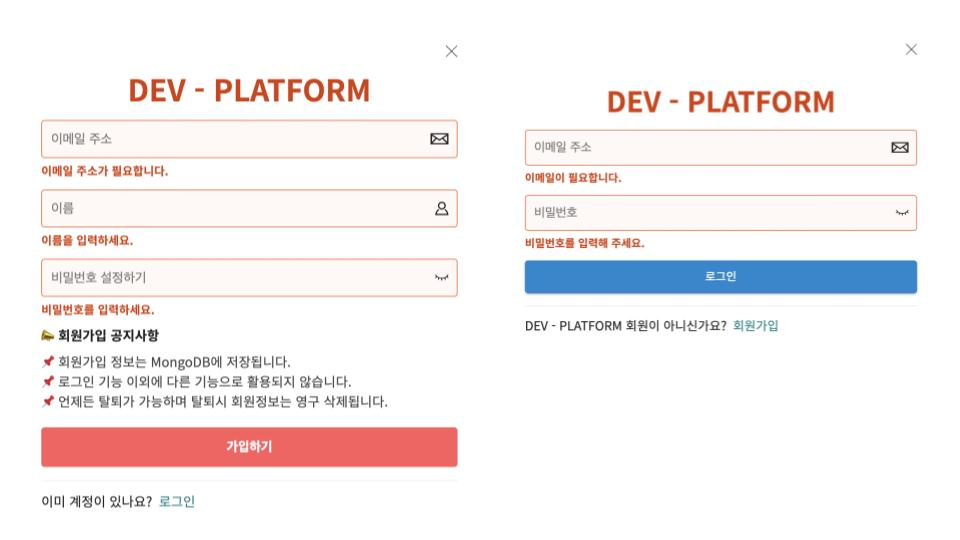
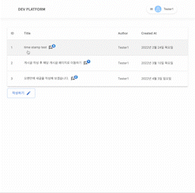
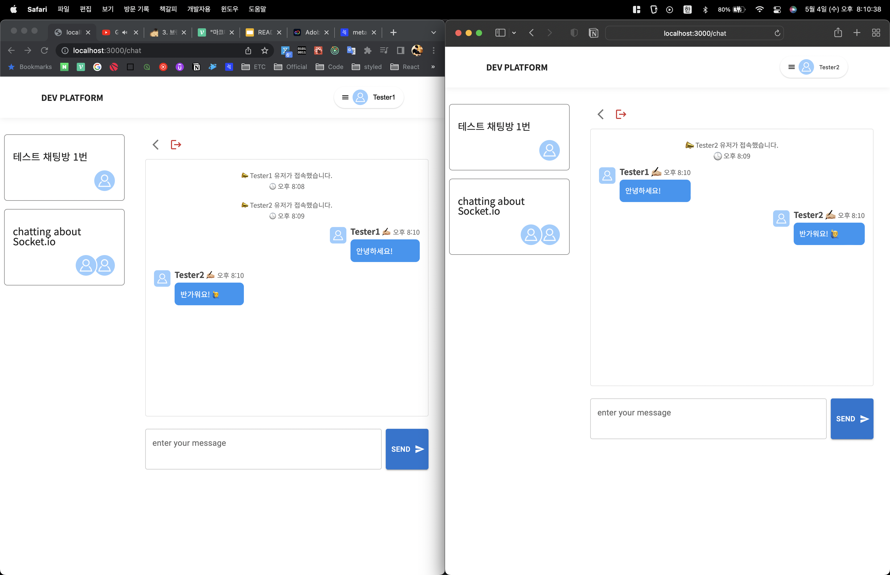

# dev-platform

> 학습한 내용을 직접 구현해 보는 프로젝트 공간 입니다. 각각의 기능들은 독립된 route로 구현하였습니다. 각각의 기능에 필요한 권한 및 의존성은 로그인 Auth 정도로 제한하여 재활용 가능한 모듈화를 지향하여 구현하고 있습니다.

# Base Stack

> 프로젝트의 주요 기술 배경은 다음과 같습니다.

## Front

- `React`
- `Next.js`
- `Typescript`
- `redux-toolkit`

## Back

- `Node.js`
- `MongoDB`

## Another

- design
  - `styled-components`
  - `Material UI`

# Implement 🖥

## 1. 회원가입 및 로그인

> 회원가입 및 로그인 기능에 대한 구현 내역입니다. Input value값에 대한 검증에 중점을 두고 구현했습니다.



### 구현내용

- 검증값을 통해 에러 메시지를 출력하는 컴포넌트
- MongoDB 데이터 연동
- `styled-components`를 활용한 UI
- input value를 검증하는 validation 함수

```ts
// * password가 email이나 이름을 포함하는지 검증
const isPasswordHasNameOrEmail = useMemo(
  () =>
    !password ||
    !name ||
    password.includes(name) ||
    password.includes(email.split("@")[0]),
  [password, name, email]
);
```

<br />

## 2. 게시판

> 게시글 및 댓글 작성, 수정, 삭제 기능을 구현한 게시판 입니다. 데이터는 MongoDB에 저장됩니다.



### 구현내용

- CRUD에 해당하는 API
- MongoDB 데이터 연동
- Material UI를 활용한 UI
- Next.js를 통한 SSR

```ts
// pages/board/[id].tsx

...
export const getServerSideProps = wrapper.getServerSideProps(
  (store: Store) => async (context: NextPageContext) => {
    const { id } = context.query;

    try {
      if (id) {
        const { data } = await getPostAPI(id as string);
        store.dispatch(boardActions.setDetail(data));
      }
    } catch (error) {
      console.log(error);
    }
  }
);
...
```

<br />

## 3. 채팅

> socket.io 라이브러리를 활용한 채팅 기능입니다.



### 구현내용

- Socket Instance를 활용한 서버 연결
- Socket event를 활용한 client-server간 데이터 전송
- styled-components를 활용한 UI

```ts
// lib/api/socket.ts
export const initiateSocket = ({ room, user }: InitiateSocketProps) => {
  socket = io({ path: "/api/chats/socketio" });
  if (socket && room) socket.emit(EVENTS.CLIENT.JOIN_ROOM, { room, user });
};

export const disconnectSocket = () => {
  if (socket) socket.disconnect();
};

export const subscribeToChat = (cb: Function) => {
  if (!socket) return true;

  socket.on(EVENTS.SERVER.ROOM_MESSAGE, (message) => {
    return cb(null, message);
  });
};

export const emitMessage = (message: EmitMessage) => {
  if (socket) socket.emit(EVENTS.CLIENT.SEND_ROOM_MESSAGE, message);
};
```

### 구현예정

- MongoDB 데이터 연동
- 채팅방 목록에 대한 UI 업데이트

<br />
